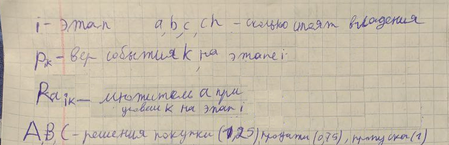
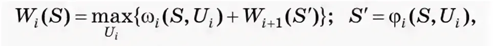
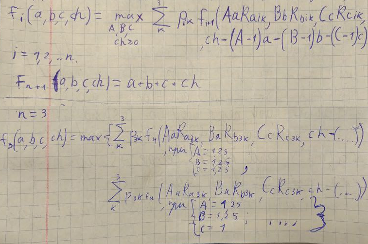
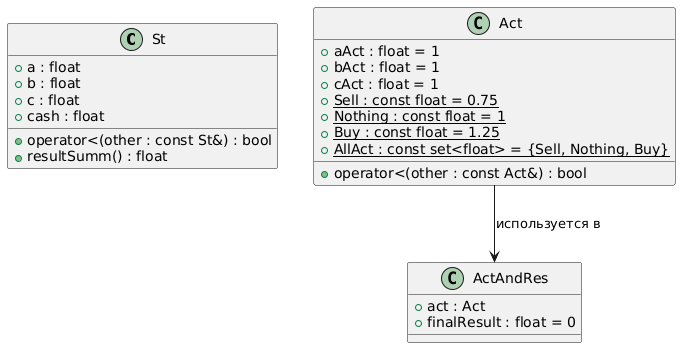

# Задание №4. Решение задачи динамического программирования

Выполнил: Проскуряков Роман Владимирович МЕТОПТ 1.2

## Цель работы

Научиться на практике составлять математическую постановку задачи вероятностного ДП и выполнять её программную реализацию.

## Постановка задачи

* Составить математическую постановку задачи
* Выписать рекуррентное соотношение Беллмана
* Составить и оформить алгоритм решения задачи
* Выполнить программную реализацию метода и определить наилучшее управление и максимальный доход

## Общая математическая формулировка задачи динамического программирования

[]()

## Рекуррентное соотношение Беллмана в общем случае

[]()

## Обозначения, постановка задачи, рекуррентное соотношение для конкретной задачи;

[]()

## Описания обратного и прямого прохождения

Алгоритм реализован с помощью рекурсии. Начинаем от стартового значения и пытаемся рассчитать f1(...), однако для этого нам нужно знать f2(...). Так мы доходим до известного fn+1(...). После этого начинается обратный проход, где уже заполняются значения предыдущих f. Для каждого состояния, передающегося в f, сохраняются результат вычислений, что позволяет не считать одну и ту же ветвь поведения по несколько раз.

## Псевдокод или схема основного алгоритма, который обеспечивает решение задачи динамического программирования

Рекурсивный алгоритм с хешированием промежуточных расчётов для оптимизации количества вычислений.

```
vector<vector<float>> p; // вероятности различных событий на рынке на всех этапах

vector<vector<float>> ra; // как разные события повлияют на цену a на всех этапах
vector<vector<float>> rb; // как разные события повлияют на цену b на всех этапах
vector<vector<float>> rc; // как разные события повлияют на цену c на всех этапах

vector<map<St, ActAndRes>> m; // хеширование проведённых расчётов. Ожидаемый результат и действие, которое стоит выполнять, если на этапе n мы находимся в встостоянии St

vector<multimap<pair<St, Act>, St>> ways; // хеширование проведённых расчётов. Список всех состояний, к которым мы можем прийти, если на этапе n в состоянии St выполним действие Act.

float calc(int n, St st, Act act) {
	float nStCash = st.cash - (st.a * (act.aAct - 1) + st.b * (act.bAct - 1) + st.c * (act.cAct - 1));
	if (nStCash < 0)
		return 0;

	float res = 0;

	for (size_t k = 0; k < M; k++)
	{
		St nSt = st;

		nSt.a *= act.aAct * ra[n][k];
		nSt.b *= act.bAct * rb[n][k];
		nSt.c *= act.cAct * rc[n][k];
		nSt.cash = nStCash;

		res += p[n][k] * calcAllAct(n + 1, nSt);
		if (n + 1 < N) {
			ways[n].insert({ {st, act}, nSt });
		}
	}

	return res;
}

float calcAllAct(int n, St st) {
	if (n == N) {
		return st.result();
	}

	auto it = m[n].find(st);
	if (it != m[n].end()) {
		it->second.finalResult;
	}

	ActAndRes bestRes;
	for (const float aAct : Act::AllAct) {
		for (const float bAct : Act::AllAct) {
			for (const float cAct : Act::AllAct) {
				Act act{ aAct, bAct, cAct };
				float res = calc(n, st, act);
				if (res > bestRes.finalResult)
					bestRes = ActAndRes{ act, res };
			}
		}
	}

	m[n].insert({ st, bestRes });
	return bestRes.finalResult;
}
```

## Диаграмма классов программы

[]()

## Демонстрационный пример работы программы 

<details>
  <summary>Исходные данные (Скопированные из exel в txt)</summary>

  ```
3
0.6	0.3	0.4
0.3	0.2	0.4
0.1	0.5	0.2

1.2	1.4	1.15
1.05	1.05	1.05
0.8	0.6	0.7

1.1	1.15	1.12
1.02	1	1.01
0.95	0.9	0.94

1.07	1.01	1.05
1.03	1	1.01
1	1	1
  ```
</details>

<details>
  <summary>Выходные данные</summary>

  ```
Sart sum: 1900
Expected sum:2057.83
Expected profit:157.827

Optimal strategy
At stage 1:
If St={ 100 800 400 600 } do Act={ + + + } -> 2057.83

At stage 2:
If St={ 150 1100 535 275 } do Act={ - = = } -> 2117.98
If St={ 131.25 1020 515 275 } do Act={ - + - } -> 1996.92
If St={ 100 950 500 275 } do Act={ - + - } -> 1879.64

At stage 3:
If St={ 157.5 1265 540.35 312.5 } do Act={ - + = } -> 2353.93
If St={ 118.125 1100 535 312.5 } do Act={ + + = } -> 2136.42
If St={ 67.5 990 535 312.5 } do Act={ + + = } -> 1969.03
If St={ 137.812 1466.25 390.113 181.563 } do Act={ + = + } -> 2249.54
If St={ 103.359 1275 386.25 181.563 } do Act={ + = + } -> 2011.34
If St={ 59.0625 1147.5 386.25 181.563 } do Act={ - + - } -> 1839.59
If St={ 105 1365.62 378.75 187.5 } do Act={ + = + } -> 2105.49
If St={ 78.75 1187.5 375 187.5 } do Act={ - + - } -> 1896.06
If St={ 45 1068.75 375 187.5 } do Act={ + + - } -> 1737.56
  ```
  
* St - исходное состояние на шаге = {a, b, c, cash}
* Act - действие, которое следует предпринять (докупить '+', не изменять '=', продать '-') = { A, B, C}
Например, на этапе 1 нужно докупить все из предложенных Цб. и Дет. Дальше в зависимости от ситуации на рынке будет 3 возможных продолжения стратегии на этапе 2.
* -> ожидаемая конечная сумма дохода при выполнении Act для St на этапе n.
</details>

## Заключение

Несмотря на то, что я уже был знаком с динамическим программированием, но решение этой задачи вызвало у меня трудности из за наличия в ней вероятностей. Поэтому выполнение этой работы было полезно для меня и моих знаний.
